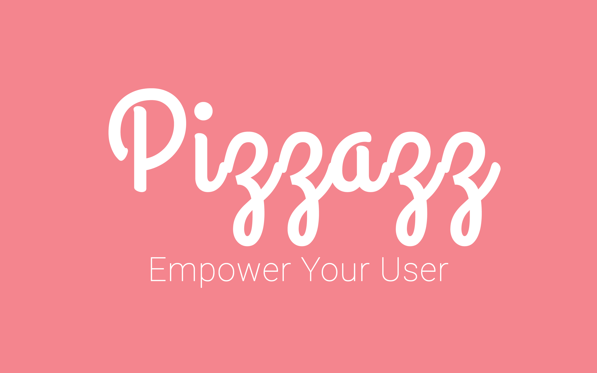

# Pizzazz
:stuck_out_tongue: A design tool that dynamically generates color schemes and design recommendations for user-generated content

## 1. Abstract
### 1.1. Project Purpose
Behind each design a designer makes exists a purpose and intent. While developing a previous idea, an automated idea board that provides you with inspiration based on semantic keywords, it has been realized that there is no solution to dynamically create pleasing color schemes for arbitrary colors. Pizzazz is that solution.

### 1.2. Background/Motivation
As a designer at heart, I have been faced with a lot of issues when it comes to designing and creating projects due to the lack of tools that are easy to use. Dynamically creating color schemes, at the very least, should be as easy as calling an API.

## 2. Technical Specifications
### 2.1. Platform
Pizzazz is a robust API that is built to dynamically adapt your interface to match user-generated content. It makes the lives of developers easier by providing a tool for generating color schemes, and design recommendations effortlessly. It will be built using a Node.JS server that runs algorithms to determine the right combinations to “pizzazz” your life.

### 2.2. Programming Languages
JavaScript, Python, HTML/CSS

### 2.3. Stylistic Conventions
JavaScript Style Guide: https://google.github.io/styleguide/javascriptguide.xml

Python Style Guide: https://google-styleguide.googlecode.com/svn/trunk/pyguide.html

HTML/CSS Style Guide: https://google.github.io/styleguide/htmlcssguide.xml
### 2.4. SDK
API: Express.JS + Node.JS

Client: "Isomorphic" Web Application - React.JS, Express, Flux, etc.

### 2.5. IDE
Atom, PyCharm

### 2.6. Tools/Interface
Google Chrome, Atom, PyCharm, iTerm, DigitalOcean/AWS

### 2.7. TargetAudience
Designers, Programmers, Enthusiasts

## 3. Functional Specifications
### 3.1. Features
The project will include but not limited to the following:
- Make color combinations through an API call
  - Complementary - Analogous
  - Triad
  - Split
  - Rectangle
- Dynamically get a color palette using an image
- Dynamically get a color palette using a website
  - Get the colors that occurs the most
- Randomly generate a color palette
- Generate a color palette based on keywords through semantic analysis
  - "Sad" would turn into dark colors (gray, black)

### 3.2. Scope of the Project
- Node.JS API
- Web client for visualization
- 4 Weeks

## 4. Timeline
### 4.1. Week 1
- Make a landing page
- Set up server
- Generate the color combinations - Set up API

### 4.2. Week 2
- Generate a color palette randomly
- Dynamically get a color palette using an image

### 4.3. Week 3
- Generate a color palette through semantic analysis - Add more documentation

### 4.4. Week 4
- Generate a color palette using a website - Polishing
(*) Subject to change

## 5. Future Enhancements
I'd like to make the service available on mobile in the future. I believe, if React is used properly, the transition from a web platform to mobile would be easier.

